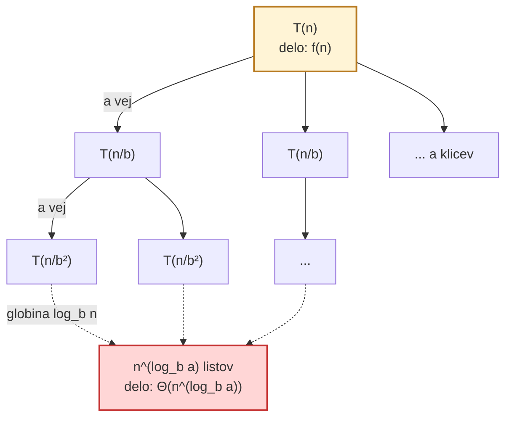
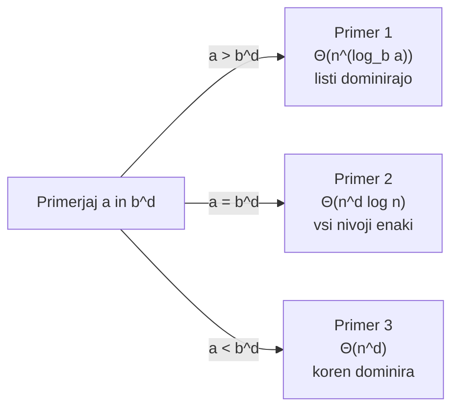
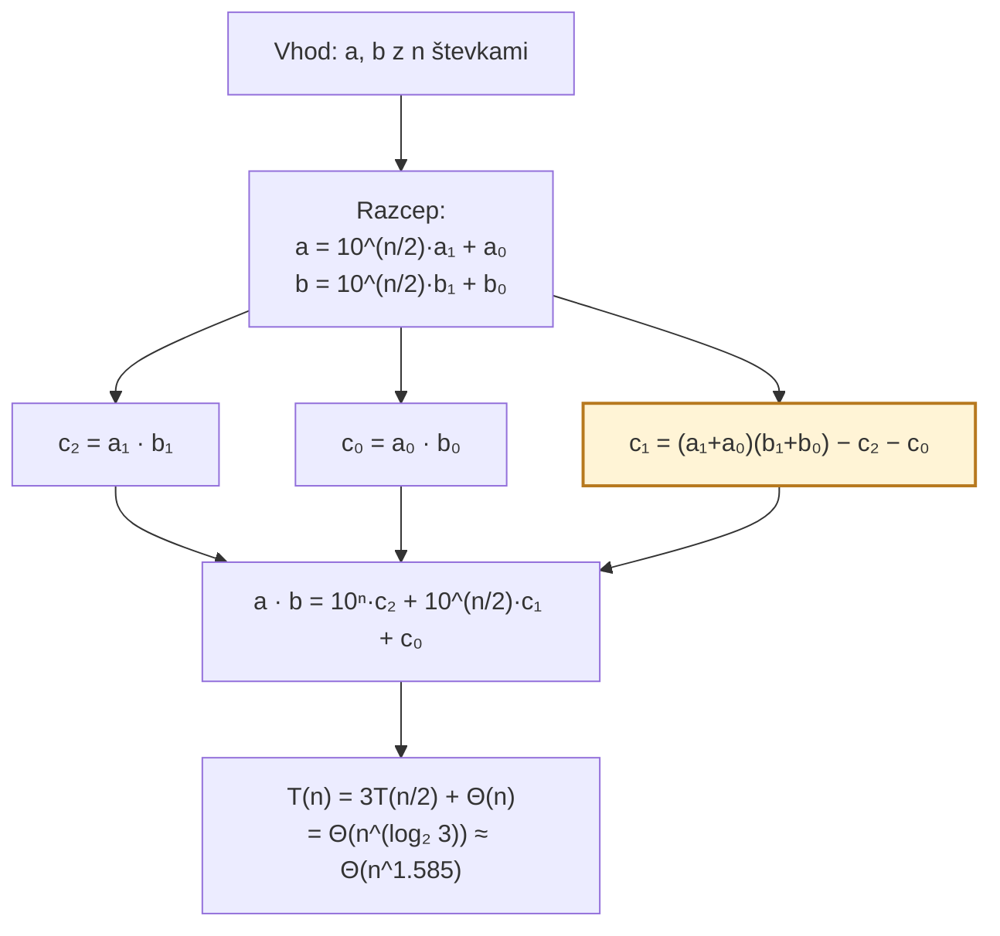

# Študijski vodič 02 – Deli in vladaj

> Cilj: ko vidiš rekurenčno enačbo, boš v 10 sekundah znal povedati zahtevnost z uporabo **krovnega izreka** ali jo izpeljati z **drevesno** ali **substitucijsko metodo**.

## 1. Bistvo v enem stavku

**"Problem velikosti $n$ razbij na $a$ podproblemov velikosti $n/b$, rešitev sestavi v $f(n)$."**

---

## 2. Intuicija – zakaj deluje

Če imaš problem velikosti $n$:
- Preveč, da ga rešiš direktno
- **Ampak**: $n/b$ je manjši, lažji. Če $a$-krat rešiš $n/b$, imaš $a$ rezultatov.
- Potrebuješ samo **pametno združevanje** rezultatov ($f(n)$).

**Rekurenčna enačba**: $T(n) = a \cdot T(n/b) + f(n)$.

---

## Vizualizaciji

### Rekurzijsko drevo



**Trije primeri krovnega izreka** ($f(n) = \Theta(n^d)$):



### Karatsubov trik: 4 → 3 množenja



> Trik je v $c_1$: namesto dveh množenj ($a_1 b_0 + a_0 b_1$) ga izračunamo z **enim** množenjem $(a_1+a_0)(b_1+b_0)$ in odštejemo $c_2 + c_0$.

---

## 3. Ključne pripodobe

### Pripodoba A: Telefonski imenik (binarno iskanje)
- $T(n) = T(n/2) + 1$ → $a=1, b=2, d=0$
- Krovni izrek: $a = b^d$ → $\Theta(\log n)$

### Pripodoba B: Pospravljanje stanovanja (Merge sort)
- Razdelitev, vsak pospravi svojo polovico, nato urediš prehode
- $T(n) = 2T(n/2) + \Theta(n)$ → $a=2, b=2, d=1$, $a = b^d$
- → $\Theta(n \log n)$

### Pripodoba C: Rekurzijsko drevo
```
                  T(n)                 ← delo: f(n)
                 /    \
              T(n/b) ... T(n/b)        ← a podproblemov; delo na nivoju 1: a·f(n/b)
             / \
         T(n/b²) ... T(n/b²)           ← a² podproblemov; delo: a²·f(n/b²)
             ...                       ← globina log_b n
       T(1) T(1) ... T(1)              ← a^(log_b n) = n^(log_b a) listov
```
**Število listov**: $n^{\log_b a}$. **Delo v listih**: $\Theta(n^{\log_b a})$.

### Pripodoba D: Karatsuba (prihrani eno množenje)
Šolsko množenje: $T(n) = 4T(n/2) + \Theta(n)$ = $\Theta(n^2)$.  
Karatsuba s trikom $c_1 = (a_1+a_0)(b_1+b_0) - c_2 - c_0$: **3 namesto 4** množenj.  
→ $T(n) = 3T(n/2) + \Theta(n)$ = $\Theta(n^{\log_2 3}) \approx \Theta(n^{1{,}585})$.

### Pripodoba E: "Smešni sort" (Stooge-Sort)
Trikrat sortiraj dve tretjini → $T(n) = 3T(2n/3) + \Theta(1)$.  
Krovni izrek: $a=3, b=3/2, d=0$, $a > b^d$ → $\Theta(n^{\log_{3/2} 3}) \approx \Theta(n^{2{,}71})$.  
Slabše od $n^2$!

---

## 4. Preslikave v druge domene

| Domena | Primer |
|---|---|
| **MapReduce (Google)** | Map = razdeli, Reduce = združi |
| **Procesorski paralelizem** | Rekurzivni forki niti |
| **Fraktali (Mandelbrot)** | Sama struktura je self-similar |
| **Strassenovo množenje matrik** | 7 množenj namesto 8 za $\Theta(n^{2{,}807})$ |
| **FFT** | $T(n) = 2T(n/2) + \Theta(n) = \Theta(n \log n)$ |
| **Closest pair of points** | $T(n) = 2T(n/2) + \Theta(n)$ |

---

## 5. Formalno jedro: Krovni izrek

Za $T(n) = a \cdot T(n/b) + f(n)$, kjer $a \geq 1, b > 1$ in $f(n) = \Theta(n^d)$:

| Primer | Pogoj | Rezultat |
|---|---|---|
| **1** (dominirajo listi) | $a > b^d$ | $T(n) = \Theta(n^{\log_b a})$ |
| **2** (enakovredno) | $a = b^d$ | $T(n) = \Theta(n^d \log n)$ |
| **3** (dominira koren) | $a < b^d$ | $T(n) = \Theta(n^d)$ |

> **Pozor na notacijo**: pri predmetu APS2 krovni izrek formuliran v obliki $a$ vs $b^d$ (kjer $f(n) = \Theta(n^d)$), ne v obliki $f(n)$ vs $n^{\log_b a}$. Rezultat je isti.

**Mnemotehnika**: $b^d$ = "delo na nivoju 1" (količnik rasti pri združevanju), $a$ = "število vej na nivoju". Če vej več kot rasti → listi zmagajo. Če enako → log faktor. Če rasti več → koren zmaga.

---

## 6. Druge tehnike (ko krovni izrek odpove)

### Drevesna metoda
1. Razvij drevo: vsak nivo prispeva določeno delo
2. Seštej delo po nivojih × globina
3. Ugibaj rezultat

**Primer** (Stooge-Sort z gled. vej): $T(n) = 5T(n/3) + \Theta(n)$.  
$a = 5, b = 3$ → $5^{\log_3 n} = n^{\log_3 5}$ listov.  
Po geometrijski vrsti: $T(n) = \Theta(n^{\log_3 5})$.

### Substitucijska metoda
Ugibaj rešitev, dokaži z indukcijo.  
**Trik**: če dokaz ne gre, **okrepi hipotezo** z odstevkom (npr. $T(n) \leq cn^{\log_3 5} - dn$ namesto $T(n) \leq cn^{\log_3 5}$).

### Slowsort (krovni izrek odpove)
$T(n) = 2T(n/2) + T(n-1) + \Theta(1)$.  
Ni v obliki krovnega izreka (mešanica deljenja in odštevanja).  
Z indukcijo: $T(n) = O(2^n)$ in $T(n) = \Omega(n^2)$.

---

## 7. Mentalno orodje: hitra analiza krovnega izreka

1. **Preberi $a, b$**: "koliko klicev" in "za koliko manjši problem"
2. **Izluščimo $d$ iz $f(n)$**: $f(n) = \Theta(n^d)$
3. **Primerjaj $a$ z $b^d$**
4. **Izberi primer** (1, 2, ali 3)

**Primer**: $T(n) = 4T(n/2) + n^2$
- $a = 4, b = 2, d = 2$
- $b^d = 4 = a$ → **Primer 2**
- $T(n) = \Theta(n^2 \log n)$

---

## 8. Kanonični primeri iz vaj (v2.pdf)

### Primer 1 — drevesna + substitucija
$T(n) = 5T(n/3) + \Theta(n)$

Drevesna: listov $n^{\log_3 5}$, nivojev $\log_3 n$, vrsta divergentna → prispevek korena obvladljiv.  
Krovni izrek (hitreje): $a=5, b=3, d=1$; $a > b^d$ ($5 > 3$) → $\Theta(n^{\log_3 5})$.

### Primer 2 — Stooge-Sort
$T(n) = 3T(2n/3) + \Theta(1)$; $a=3, b=3/2, d=0$; $a > b^d$ → $\Theta(n^{\log_{3/2} 3}) \approx \Theta(n^{2{,}71})$.

### Primer 3 — Slowsort (brez krovnega)
$T(n) = 2T(n/2) + T(n-1) + \Theta(1)$; $O(2^n)$ in $\Omega(n^2)$ z indukcijo.

### Primer 4 — Karatsuba (DN2)
$T(n) = 3T(n/2) + \Theta(n)$; $a=3, b=2, d=1$; $a > b^d$ → $\Theta(n^{\log_2 3}) \approx \Theta(n^{1{,}585})$.

---

## 9. Naloge

### Naloga 1
$T(n) = 9T(n/3) + n$. Zahtevnost?

<details>
<summary>Rešitev</summary>

$a=9, b=3, d=1$. $b^d = 3 < 9 = a$ → **Primer 1** → $\Theta(n^{\log_3 9}) = \Theta(n^2)$.
</details>

### Naloga 2
$T(n) = 2T(n/2) + n \log n$. Zahtevnost?

<details>
<summary>Rešitev</summary>

$f(n) = n \log n$ ni oblike $\Theta(n^d)$ — razlika od $n^{\log_2 2} = n$ je **logaritmska, ne polinomska** → krovni izrek **ne velja**.  
Rezultat (z drevesno metodo): $\Theta(n \log^2 n)$.
</details>

### Naloga 3 (Karatsuba)
Zakaj je Karatsuba asimptotsko boljši od šolskega množenja?

<details>
<summary>Rešitev</summary>

Šola: $T(n) = 4T(n/2) + \Theta(n)$ → $\Theta(n^2)$.  
Karatsuba: $T(n) = 3T(n/2) + \Theta(n)$ → $\Theta(n^{\log_2 3}) \approx \Theta(n^{1{,}585})$.  
Razlika: prihrani 1 od 4 množenj na vsakem nivoju s trikom $c_1 = (a_1+a_0)(b_1+b_0) - c_2 - c_0$.
</details>

### Naloga 4 (substitucijska metoda)
Dokaži, da $T(n) = 5T(n/3) + \Theta(n)$ je $O(n^{\log_3 5})$.

<details>
<summary>Rešitev</summary>

Hipoteza $T(n) \leq cn^{\log_3 5}$ **ne zdrži** pri direktnem dokazu (dobimo dodaten $\Theta(n)$, ki ga ne moremo pokriti).  
**Okrepi**: $T(n) \leq cn^{\log_3 5} - dn$. Vstavi:
$$T(n) \leq 5(c(n/3)^{\log_3 5} - dn/3) + \Theta(n) = cn^{\log_3 5} - dn + (\Theta(n) - 2dn/3)$$
Za dovolj velik $d$ je drugi člen $\leq 0$, torej $T(n) \leq cn^{\log_3 5} - dn \leq cn^{\log_3 5}$.
</details>

### Naloga 5 (Stooge-Sort — intuicija)
Zakaj je Stooge-Sort slabši od navadnega urejanja?

<details>
<summary>Rešitev</summary>

Stooge-Sort: $\Theta(n^{\log_{3/2} 3}) \approx \Theta(n^{2{,}71})$.  
Navadno vstavljanje: $\Theta(n^2) < \Theta(n^{2{,}71})$.  
Ker Stooge trikrat kliče na $2/3$ velikosti, ima $a=3, b=3/2$, kar je **slabše** od $a=2, b=2$ (merge sort).
</details>

### Naloga 6 (Slowsort — sinteza)
Zakaj ne moreš Slowsorta analizirati s krovnim izrekom?

<details>
<summary>Rešitev</summary>

Rekurenca $T(n) = 2T(n/2) + T(n-1) + \Theta(1)$ ima **mešanico** delitev ($n/2$) in zmanjšanj ($n-1$). Krovni izrek zahteva vsa $T(\cdot)$ v obliki $T(n/b)$ za **isti** $b$.  
Rešitev: substitucijska metoda; dokažeš $O(2^n)$ in $\Omega(n^2)$.
</details>

---

## 10. Preveri sam(a) sebe

1. Kaj pomenijo $a, b, d$ v krovnem izreku?
2. Trije primeri krovnega izreka — kdaj kateri?
3. Kdaj krovni izrek **ne** deluje?
4. Kaj je bistvo Karatsubovega trika?
5. Kako okrepiš hipotezo v substitucijski metodi?
6. Časovna zahtevnost Stooge-Sort in zakaj je slaba?

---

## 11. Najpogostejše pasti

- **Napačno branje $a, b$**: $a$ = koliko klicev, $b$ = za kolikokrat manjši problem
- **Krovni izrek za ne-polinomski $f(n)$**: $f(n) = n/\log n$ ali $n \log n$ ne sodi v okvir
- **Pozabljanje baznega primera** pri dokazu z indukcijo
- **Ne-okrepljena hipoteza** v substitucijski metodi ne gre skozi
- **Pozabljanje ne-rekurzivnega dela** $f(n)$ (nisi sestavil celotnega dela!)

---

## 12. Povezave

- [[APS2-Deli_in_vladaj]] — referenca
- [[Divide_and_conquer]] — konceptualni pregled
- Prejšnji vodič: [[guide-01-Racunska_zahtevnost]]
- Naslednji vodič: [[guide-03-Amortizirana_casovna_zahtevnost]]

---

## 13. Kartice za aktivni priklic (#flashcards)

> Sintaksa vtičnika **Spaced Repetition**: inline `Q::A`, reverse `Q:::A`.

### Krovni izrek

Oblika rekurence pri krovnem izreku?::$T(n) = a \cdot T(n/b) + f(n)$, kjer $f(n) = \Theta(n^d)$

Primer 1 krovnega izreka: pogoj in rezultat?::$a > b^d \Rightarrow T(n) = \Theta(n^{\log_b a})$ (listi dominirajo)

Primer 2 krovnega izreka: pogoj in rezultat?::$a = b^d \Rightarrow T(n) = \Theta(n^d \log n)$

Primer 3 krovnega izreka: pogoj in rezultat?::$a < b^d \Rightarrow T(n) = \Theta(n^d)$ (koren dominira)

Kdaj krovni izrek NE velja?::Kadar $f(n)$ ni oblike $\Theta(n^d)$ (npr. $n \log n$) ali rekurenca ni enotne oblike (Slowsort)

### Algoritmi

Merge sort rekurenca in zahtevnost?::$T(n) = 2T(n/2) + \Theta(n) \Rightarrow \Theta(n \log n)$

Karatsuba rekurenca in zahtevnost?::$T(n) = 3T(n/2) + \Theta(n) \Rightarrow \Theta(n^{\log_2 3}) \approx \Theta(n^{1{,}585})$

Karatsubov trik — kateri trije produkti?
?
$c_2 = a_1 b_1$, $c_0 = a_0 b_0$, $c_1 = (a_1+a_0)(b_1+b_0) - c_2 - c_0$

Stooge-Sort rekurenca in zahtevnost?::$T(n) = 3T(2n/3) + \Theta(1) \Rightarrow \Theta(n^{\log_{3/2} 3}) \approx \Theta(n^{2{,}71})$ — slabše od $n^2$!

Slowsort rekurenca?::$T(n) = 2T(n/2) + T(n-1) + \Theta(1)$; $O(2^n)$ in $\Omega(n^2)$

### Tehnike

Dve alternativni tehniki kadar krovni izrek odpove?::drevesna metoda (razvij drevo, seštej nivoje) in substitucijska metoda (ugibaj + indukcija)

Trik pri substitucijski metodi, ko hipoteza ne gre skozi?::Okrepi hipotezo (npr. $T(n) \leq cn^{\log_3 5} - dn$ namesto $T(n) \leq cn^{\log_3 5}$)
