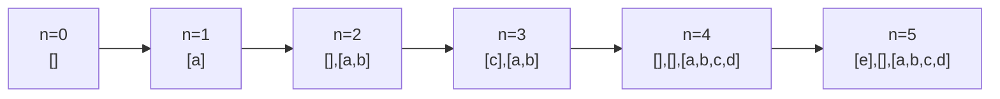

# Študijski vodič 03 – Amortizirana časovna zahtevnost

> Cilj: znati izbrati pravo metodo (agregatna / bančna / potencialna) za analizo zaporedja operacij.

## 1. Bistvo v enem stavku

**"Ne gledamo najhujšega primera ene operacije, ampak povprečje skozi celotno zaporedje."**

---

## 2. Intuicija – zakaj to potrebujemo

Najhuji scenarij posameznih operacij zna biti **pretiran**. Primer:
- **Dinamično polje**: `push` v 99.9 % primerov je $O(1)$. Le občasno, ko se polje napolni, se podvoji v $O(n)$.
- **Najhuji primer**: $O(n)$ → napačno!
- **Amortizirana cena**: $O(1)$ → prava zgodba.

Drage operacije **plačamo vnaprej** s poceni operacijami — in povprečje ostane nizko.

---

## 3. Ključne pripodobe

### Pripodoba A: Mesečna kartica vlaka
- Posamezna vožnja: 5 €
- Mesečna kartica: 50 € / 30 voženj ≈ 1,67 € na vožnjo
- **Amortizirana cena** = 1,67 €, tudi če nekateri dnevi "ne voziš" ali "voziš 5×"

### Pripodoba B: Pralni stroj (Multipop)
- Vsak dan mečeš eno oblačilo v koš (`push`)
- Ko je koš poln, sprožiš **veliko pranje** (`multipop`)
- Cena pranja = število oblačil, AMPAK: že plačano vsak dan s košem
- **Ključ**: ne moreš popniti več, kot si pushnil

### Pripodoba C: Bančni račun (accounting metoda)
- Pri vsakem `push` plačaš **3 €** (ne 1 €)
- 1 € gre za samo vstavljanje
- 2 € gre **v banko** (depozit)
- Ko pride `pop`, depozit pokrije stroške
- Dokler je saldo ≥ 0, si varno v $O(1)$ amortizirano

### Pripodoba D: Rezervoar vode (potencialna metoda)
- **Stanje** strukture = višina vode $\Phi(D)$
- **Dodaj** element → višina raste ("shranjuješ energijo")
- **Draga operacija** → višina pade ("poraba energije")
- Amortizirana cena = dejanska cena **+ sprememba višine**
- $\Phi(D_0) = 0$, vedno $\Phi(D_i) \geq 0$

### Pripodoba E: Selitev (dinamično polje)
- Stanuješ v stanovanju velikosti $k$
- Dodajaš pohištvo
- Ko je polno → se preseliš v **2×** večje
- Selitev je draga (premikaš vse), AMPAK: med selitvama si pridobil dovolj "mesecev najemnine"
- Povprečni strošek življenja je $O(1)$

---

## 4. Preslikave v druge domene

| Domena | Primer |
|---|---|
| **Redis rehashing** | Ko se `HashMap` napolni, se podvoji — ammortizirano $O(1)$ |
| **Python list.append** | CPython uporabi dinamično polje, ammortizirano $O(1)$ |
| **Git pack-files** | Majhne operacije, občasno velika reorganizacija |
| **Garbage collection** | Mala alokacija poceni, občasni GC drag → povprečno OK |
| **CPU cache** | "Prefetch" kot depozit za kasnejše branje |

---

## 5. Tri metode formalno

### Metoda 1: **Agregatna**
Izračunaj **skupno ceno** zaporedja $n$ operacij, deli z $n$.

$$\text{amortizirana cena} = \frac{\sum c_i}{n}$$

Primer: multipop — $n$ operacij skupaj $\leq 2n$ dela → $O(1)$ amortizirano.

### Metoda 2: **Bančna (accounting)**
Vsaki operaciji dodeli "pristojbino" $\hat{c}_i$, ki jo plačaš, tudi če dejansko stane manj. Razlika gre **v banko**.

**Zahteva**: banka nikoli ne sme biti negativna.

$$\sum_{i=1}^{n} \hat{c}_i \geq \sum_{i=1}^{n} c_i$$

### Metoda 3: **Potencialna**
Definiraj funkcijo $\Phi: D \to \mathbb{R}_{\geq 0}$ z $\Phi(D_0) = 0$.

$$\hat{c}_i = c_i + \Phi(D_i) - \Phi(D_{i-1})$$

**Zahteva**: $\Phi$ vedno $\geq 0$.

---

## 6. Mentalno orodje: "katero metodo izbrati?"

- **Agregatna**: ko je hitro videti skupno ceno (multipop, binarni števec)
- **Bančna**: ko znaš intuitivno dodeliti "pristojbine" različnim tipom operacij
- **Potencialna**: najmočnejša, uporabi, ko je stanje strukture spremenljivo (dinamično polje)

---

## 7. Trije kanonični primeri

### Multipop sklad
$$\Phi(D) = |S|$$

| Op | $c_i$ | $\Delta\Phi$ | $\hat{c}_i$ |
|---|---|---|---|
| push | 1 | +1 | 2 |
| pop | 1 | −1 | 0 |
| multipop($k$) | $k$ | $-k$ | 0 |

Vse $O(1)$ amortizirano.

### Dinamično polje
$$\Phi(D) = 2 \cdot \text{size} - \text{capacity}$$

- Push brez podvajanja: $\hat{c} = 1 + 2 = 3$
- Push s podvajanjem ($k$ kopij): $\hat{c} = (k+1) + (2 - k) = 3$

Vedno $O(1)$.

### Binarni števec
$$\Phi(D) = \text{št. enic}$$

Inkrement: popravi $t$ enic na 0, nato doda 1 eno.
- $c_i = t + 1$, $\Delta\Phi = 1 - t$
- $\hat{c}_i = 2 = O(1)$

---

## 8. Naloge iz vaj (v3)

### Naloga 1 — dinamično polje s **linearnim** raztegom (+10)
Namesto podvajanja kapacitete tabelo vsakič povečamo za natanko **10** elementov. Kakšna je amortizirana cena `push`-a po vseh **treh** metodah?

> [!success]- Agregatna metoda
> Pri $n$ pushih se $i$-ta skupina 10 elementov prekopira $\lceil n/10 \rceil - i + 1$-krat. Skupno delo:
> $$T(n) \leq 10 \cdot \big(1 + 2 + \ldots + \lceil n/10 \rceil\big) = 10 \cdot \tfrac{1}{2} \lceil n/10 \rceil (\lceil n/10 \rceil + 1) = O(n^2).$$
> Amortizirano na push: $O(n)$. Velja tudi $\Omega(n^2)$ skupaj, torej tesno $\Theta(n)$ na push.

> [!success]- Računovodska metoda
> Tik po raztegu na kapaciteto $n+10$ je v tabeli $n$ elementov. Naslednjih 10 pushov mora pokriti:
> – lastno vselitev (1),
> – lastno prestavitev pri naslednjem raztegu (1),
> – delež prestavitev že obstoječih elementov ($n/10$ na element).
>
> Računovodska cena posamičnega push-a:
> $$\hat{c} = 1 + 1 + \lfloor n/10 \rfloor = 2 + \lfloor n/10 \rfloor = O(n).$$
> Skupno: $\sum \hat{c}_i = O(n^2)$, kar je zgornja meja dejanske cene.

> [!success]- Potencialna metoda
> Potencial mora biti 0 takoj po raztegu in tik pred naslednjim dovolj velik, da plača prestavitev vseh elementov. Vzorec: $1, 2, \ldots, 10, 2, 4, \ldots, 20, 3, 6, \ldots$
> $$\Phi(n) = \lceil n/10 \rceil \cdot \big((n-1) \bmod 10 + 1\big), \quad \Phi(0) = 0, \ \Phi \geq 0.$$
> Brez raztega ($n$ ni večkratnik 10): $c = 1$, $\Delta\Phi = \lceil n/10 \rceil$, torej $\hat{c} = 2 + \lfloor n/10 \rfloor$.
> Z raztegom ($n$ je večkratnik 10): $c = 1 + n$, $\Delta\Phi = (n/10 + 1) - n$, torej $\hat{c} = 2 + n/10$.
> Obe vejo dasta isto računovodsko ceno kot zgoraj. ✓

> [!warning] Pouk
> Linearni razteg = $\Theta(n)$ amortizirano. Geometrijski (×2) = $\Theta(1)$. Konstantni faktor rasti je **kvalitativno** drugačen.

---

### Naloga 2 — pomožna identiteta (vrsta)
Dokaži, da za $x \in (0, 1)$ velja
$$\sum_{i=1}^{\infty} i x^{i-1} = \frac{1}{(1-x)^2}.$$

> [!success]- Rešitev
> Geometrijska vrsta: $\sum_{i=1}^{\infty} x^i = \tfrac{x}{1-x}$, oziroma $\sum_{i=0}^{\infty} x^i = \tfrac{1}{1-x}$. Odvajaj člen za členom:
> $$\sum_{i=1}^{\infty} i x^{i-1} = \frac{d}{dx} \sum_{i=1}^{\infty} x^i = \frac{d}{dx} \frac{1}{1-x} = \frac{1}{(1-x)^2}.$$
> Pri $x = 1/2$ dobimo $\sum_{i=1}^{\infty} i (1/2)^{i-1} = 4$ — uporabljali bomo v nalogah 3 in 4.

---

### Naloga 3 — gradnja kopice iz tabele
Tabelo z $n = 2^k - 1$ elementi pretvorimo v kopico s **pogrezanjem od spodaj navzgor** (Floyd build-heap). Kakšna je amortizirana cena na element?

> [!success]- Rešitev
> Na predzadnjem nivoju je $n/4$ elementov, vsak pogrezne za največ 1. Na predpredzadnjem $n/8$ elementov × 2, …, na vrhu 1 element × $(\lg n - 1)$.
> $$\sum_{i=1}^{\lg n - 1} \frac{n}{2^{i+1}} \cdot i = \frac{n}{4} \sum_{i=1}^{\lg n - 1} i \left(\tfrac{1}{2}\right)^{i-1} \leq \frac{n}{4} \cdot \frac{1}{(1 - 1/2)^2} = n.$$
> Skupaj $O(n)$. Amortizirano na element: $\boxed{O(1)}$.

---

### Naloga 4 — BST iz **bitno obrnjenega** zaporedja
Števila $1, \ldots, n = 2^k - 1$ uredimo po zrcalni sliki dvojiškega zapisa (npr. $4, 2, 6, 1, 5, 3, 7$ za $k = 3$) in jih dodamo v navadno BST. Dobimo **polno** drevo. Amortizirana cena dodajanja?

> [!success]- Rešitev
> Štejmo primerjave. Koren: 0. Drugi nivo: $2 \cdot 1$. Tretji: $4 \cdot 2$. … $i$-ti: $2^{i-1}(i-1)$.
> $$T(n) = \sum_{i=1}^{k} \frac{n}{2^i}(k - i) = nk \sum_{i=1}^{k} \tfrac{1}{2^i} - \tfrac{n}{2} \sum_{i=1}^{k} i \cdot \tfrac{1}{2^{i-1}}.$$
> Prva vsota $< 2$, druga $< 4$ (naloga 2). S $k = \lceil \lg n \rceil$:
> $$T(n) = O(n \log n).$$
> Amortizirano na vstavljanje: $\boxed{O(\log n)}$.

---

## 9. Domača naloga: dinamično dvojiško iskanje (DN3)

**Struktura**: za $n$ elementov vzdržujemo urejene tabele velikosti $1, 2, 4, 8, \ldots, 2^{k-1}$. Tabela velikosti $2^i$ je polna natanko tedaj, ko je $i$-ti bit $n$ enak 1 (npr. $n = 13 = 1101_2$ → polne tabele velikosti 1, 4, 8).

**Vstavljanje**: poišči najkrajšo prazno tabelo (velikost $2^k$), zlij vse manjše + nov element vanjo (krajše se izpraznijo).

### Vprašanja iz neobveznega dela DN3

**(a)** Agregatna analiza amortizirane cene `push`-a.

> [!success]- Rešitev
> Pri vsakem $i$-tem bitu, ki postane 1, plačamo zlitje stroška $2^i$. Bit $i$ se "obrne v 1" $\lfloor n / 2^i \rfloor$ krat skozi $n$ pushov. Skupno:
> $$T(n) \leq \sum_{i=0}^{\lceil \lg n \rceil} \frac{n}{2^i} \cdot 2^i = n (\lg n + 1) = O(n \log n).$$
> Amortizirano na push: $\boxed{O(\log n)}$.
>
> Analogija: enako kot pri **binarnem števcu**, le da prehod 0→1 na biti $i$ stane $2^i$ namesto 1.

**(b)** Računovodska cena push-a.

> [!success]- Rešitev
> Vsakemu push-u pripiši $\hat{c} = \lceil \lg n \rceil + 1$ enot. Vsaka enota "potuje skupaj z elementom" naprej, ko se ta zlije v večjo tabelo (en nivo višje). Element gre kvečjemu $\lceil \lg n \rceil$ nivojev navzgor, vsako selitev plača svoja enota → saldo nenegativen. ✓

**(c)** Potencial, usklajen z (b).

> [!success]- Rešitev
> $$\Phi(D) = \sum_{i: \text{tabela } 2^i \text{ polna}} 2^i \cdot (\lceil \lg n \rceil - i).$$
> Ko push napolni nove (manjše) tabele in jih kasneje zlije v večjo, $\Phi$ pade ravno za ceno zlitja. Vsaka push amortizirano $O(\log n)$.
>
> Krajša varianta: $\Phi(D) = \log n \cdot n - \sum_{i: \text{poln}} i \cdot 2^i$. Postopek izpeljave je analogen kot pri binarnem števcu, le z utežmi $2^i$.

**(d)** Najslabša cena `find`?

> [!success]- Rešitev
> Dvojiško iskanje v vsaki polni tabeli posebej:
> $$\sum_{i: \text{poln}} \lceil \lg 2^i \rceil = \sum_{i: \text{poln}} i \leq 0 + 1 + \ldots + (k-1) = O(\log^2 n).$$
> **Najslabše: $\Theta(\log^2 n)$** (vsi biti enice).

**(e)** $n$ parov `(push, find)` skupaj?

> [!success]- Rešitev
> $n \cdot O(\log n) + n \cdot O(\log^2 n) = O(n \log^2 n)$.

**(f)** Brisanje (namig: "luknje").

> [!success]- Rešitev
> Označi izbrisani element kot **logično luknjo** (npr. tombstone), namesto da takoj reorganiziraš strukturo. Ko je razmerje lukenj prek pragom (npr. polovica), prestavi vse žive elemente nazaj v kanonično strukturo (analogno restrukturiranju hash tabele). Amortizirano $O(\log n)$ na delete.

---

## 10. Preveri sam(a) sebe

1. Kaj zahteva potencialna funkcija? (3 pogoji)
2. V katerem primeru je agregatna metoda premalo?
3. Pokaži z eno vrstico, zakaj multipop je $O(1)$ amortizirano.
4. Zakaj je amortizirana cena "zgornja meja" realne cene?
5. Opiši primer, kjer je amortizirano $O(1)$, ampak najhuji primer $O(n)$.
6. Razloži, zakaj **linearen** razteg dinamičnega polja da $\Theta(n)$, ne $\Theta(1)$ na push.
7. Pokaži vsoto $\sum_{i=1}^{\infty} i \cdot 2^{-i}$ in kje jo uporabiš.

---

## 11. Najpogostejše pasti

- **Potencial postane negativen** — invarianta zlomljena, analiza neveljavna
- **Pozabljanje $\Phi(D_0) = 0$** — ali vsaj majhna začetna vrednost
- **Mešanje amortizirane in povprečne analize** — niso isto!
- **Dvojno štetje dela** — enkrat pri pristojbini, enkrat pri direktnem
- **Premajhna pristojbina** → banka gre v minus
- **Konstantni razteg ≠ konstantna amortizacija** — geometrijski je ključen

---

## 12. Povezave

- [[APS2-Amortizirana_casovna_zahtevnost]] — referenca
- [[Potencialna_funkcija]] — poglobljen pregled metode
- Prejšnji vodič: [[guide-02-Deli_in_vladaj]]
- Naslednji vodič: [[guide-04-Pozresni_algoritmi]] *(še ne napisan)*
